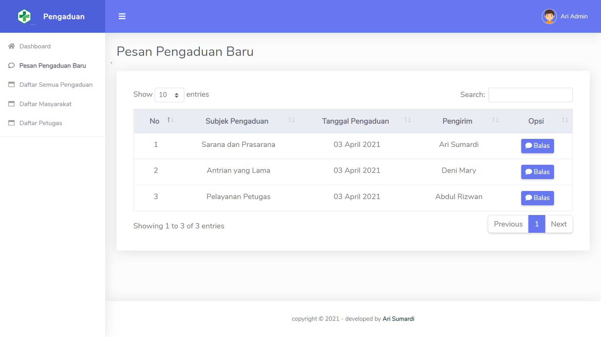

# Sistem Layanan Pengaduan Pasien di Puskesmas Kecamatan X
## Information
Sistem layananan pengaduan merupakan sebuah website yang berfungsi untuk mewadahi komplain-komplain dari masyarakat atau pasien
pada sarana, prasarana atau pelayanan yang diberikan oleh Puskesmas. Terdapat tiga hak akses di website ini, yaitu masyarakat yang dapat membuat pengaduan serta admin dan petugas yang dapat membalas pengaduan yang diberikan oleh masyarakat. 
[Demo aplikasi](https://pengaduan.arisumardi.my.id/)

## Screenshot 

## Prerequisites
* WAMPP/XAMPP Server
* PHP version 7++

## How To Use
* Clone or Download this repository
* Place the folder to /htdocs/
* Create database pengaduan_db in phpmyadmin
* Import file __pengaduan_db(2).sql__ to your database
* Run project from your browser